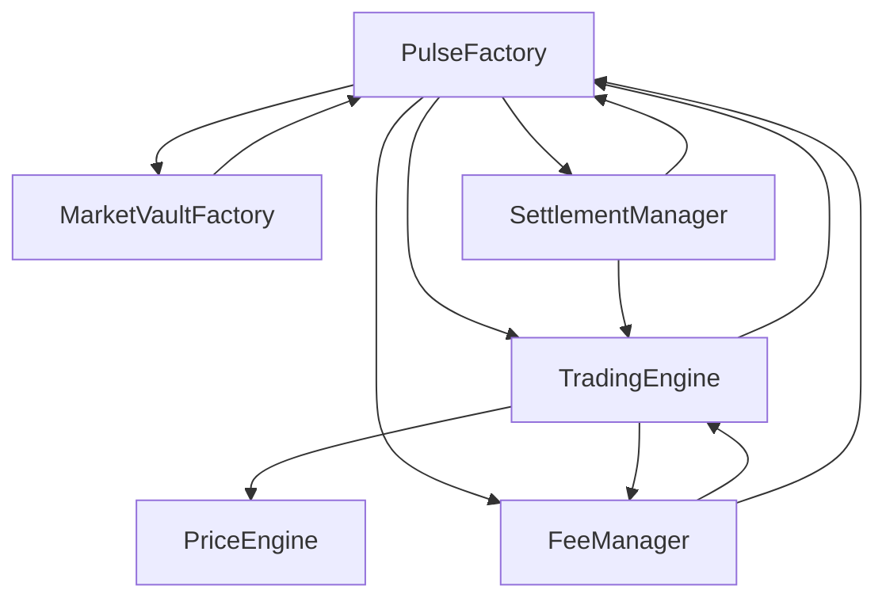

# Pulse Protocol V1 — Stage 8 Deployment Architecture

## 1. Deployment Objectives

The primary objective of Stage 8 is to transition Pulse Protocol V1 from a "Frozen Development" state to a "Live Protocol" state on Ethereum Sepolia and subsequently Mainnet. This process must be:
- **Deterministic**: Every contract address and initialization state must be predictable and verifiable.
- **Atomic**: The entire protocol suite must be deployed and wired together as a single logical unit.
- **Auditable**: Every step of the deployment must be recorded and verifiable against the frozen RC1 source code.

## 2. Deployment Principles

- **Immutability First**: No upgradeable proxies. All core modules are deployed as final, immutable logic.
- **Principle of Least Privilege**: Modules are granted only the minimum necessary authorizations (e.g., TradingEngine can deposit/withdraw from Vault, but not settle).
- **Zero-Trust Initialization**: Initialization hooks (like `setFeeManager`) must be guarded and callable only once by the deployment coordinator (PulseFactory).
- **Standardized Environment**: All deployments must use the same compiler version (0.8.24), optimizer settings (200 runs), and EVM target (Cancun).

## 3. Immutable Protocol Assumptions

- **Settlement Token**: The protocol assumes a standard ERC20 token (e.g., USDT, USDC). Fee-on-transfer or rebasing tokens are NOT supported.
- **Global Shared Modules**: `TradingEngine`, `FeeManager`, `SettlementManager`, and `PriceEngine` are shared across all markets created by a specific `PulseFactory`.
- **Per-Market Isolation**: Each market (View) has its own dedicated `MarketVault`, ensuring total collateral isolation.

## 4. Contract Dependency Graph

The Pulse Protocol V1 architecture contains a circular dependency between the core modules due to their cross-contract authorization model.

## 5. Deployment Sequence (Deterministic)

To resolve the circular dependency, the deployment must use **Address Prediction** (via `CREATE2` or nonce-based pre-calculation).

| Step | Contract | Dependencies (Constructor Args) |
| :--- | :--- | :--- |
| 1 | **PriceEngine** | None |
| 2 | **MarketVaultFactory** | PulseFactory (Predicted) |
| 3 | **TradingEngine** | PulseFactory (Predicted), PriceEngine, FeeManager (Predicted) |
| 4 | **FeeManager** | TradingEngine (Predicted), PulseFactory (Predicted), Treasury, Team |
| 5 | **SettlementManager** | TradingEngine (Predicted), PulseFactory (Predicted) |
| 6 | **PulseFactory** | MarketVaultFactory, TradingEngine, SettlementManager, FeeManager, SettlementToken |

## 6. Initialization Sequence

After deployment, the following one-time initialization occurs atomically during market creation:
1.  **Market Creation**: `PulseFactory.createView()` is called.
2.  **Vault Deployment**: `PulseFactory` calls `MarketVaultFactory.deployVault()`.
3.  **Fee Authorization**: `PulseFactory` calls `MarketVault.setFeeManager(feeManager)`. This is a one-time call allowed only for the Factory/Deployer.

## 7. Constructor Parameter Table

| Contract | Parameter | Description |
| :--- | :--- | :--- |
| **MarketVaultFactory** | `_authorizedFactory` | The address of the PulseFactory. |
| **TradingEngine** | `_factory` | The address of the PulseFactory. |
| | `_priceEngine` | The address of the PriceEngine. |
| | `_feeManager` | The address of the FeeManager. |
| **FeeManager** | `_tradingEngine` | The address of the TradingEngine. |
| | `_factory` | The address of the PulseFactory. |
| | `_treasury` | Address for 30% fee distribution. |
| | `_team` | Address for 20% fee distribution. |
| **SettlementManager** | `_tradingEngine` | The address of the TradingEngine. |
| | `_factory` | The address of the PulseFactory. |
| **PulseFactory** | `_vaultFactory` | The address of the MarketVaultFactory. |
| | `_tradingEngine` | The address of the TradingEngine. |
| | `_settlementManager`| The address of the SettlementManager. |
| | `_feeManager` | The address of the FeeManager. |
| | `_settlementToken` | The ERC20 token used for settlement. |

## 8. Deployment Verification Checkpoints

- **Bytecode Match**: Verify deployed bytecode against RC1 artifacts.
- **Dependency Wiring**: Call `factory()`, `tradingEngine()`, etc., on all deployed contracts to confirm they point to the correct addresses.
- **Vault Creation**: Execute a test market creation on Sepolia to verify the `MarketVault` is deployed and `FeeManager` is correctly authorized.
- **Treasury/Team Config**: Confirm `FeeManager` is initialized with the correct Treasury and Team addresses.

## 9. Supported Environments

### Sepolia Architecture
- **Settlement Token**: MockUSDT (deployed for testing).
- **Treasury/Team**: Test wallets.
- **Objective**: Full E2E verification and smoke testing.

### Future Mainnet Architecture
- **Settlement Token**: USDC or USDT (Official addresses).
- **Treasury/Team**: Multi-sig wallets (Gnosis Safe).
- **Objective**: Production launch.

## 10. Rollback Philosophy & Risk Analysis

- **Rollback**: Since contracts are immutable, "rollback" means redeploying the entire suite with corrected parameters and abandoning the previous deployment.
- **Risk**: Circular dependency prediction error. If addresses are pre-calculated incorrectly, the suite will be non-functional.
- **Mitigation**: Use a standardized deployment script that handles address prediction and verification in a dry-run mode before execution.
